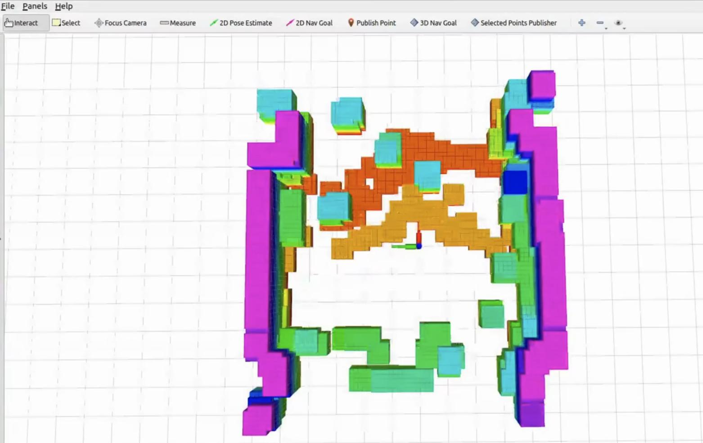

# Diff-Navigation

## 概述
**Diff-Navigation** 是为**微分智飞**公司旗下教育无人机子品牌**非凸空间**适配的单机导航避障算法。其基于开源算法 **[EGO-Planner-v2](https://github.com/ZJU-FAST-Lab/EGO-Planner-v2)** ，并由原班人马深度参与算法优化。在继承 **EGO-Planner** 优秀框架的基础上，针对教育无人机平台的特殊需求进行了全面适配和增强，旨在提供更稳定、更可靠的科研体验。

## 实机运行步骤

### 1. 下载源码并编译
  ```
  git clone --recursive https://github.com/DifferentialRobotics/Diff-Navigation.git
  cd Diff-Navigation
  catkin_make
  ```

### 2. 雷达定位自主避障飞行
0. 按照 **faster-lio** 中的readme配置好雷达定位参数，并启动雷达定位脚本测试定位是否正常：
    ```
    cd Diff-Navigation
    ./sh_files/run_lio.sh
    ```
    启动脚本后拿起无人机在空中晃动，并沿飞行场地行走一圈后放回原地，查看定位是否稳定。

1. 在配置文件 [multipointplan_exp_lio.launch](src/Diff-Planner/user_command/launch/multipointplan_exp_lio.launch) 中
查看设置的飞行模式

    >+  `fligt_type` 为 1 表示选择 `test1` 模式进行多点规划，即依次经过各途经点

    >+  `fligt_type` 为 2 表示选择 `test2` 模式进行多点规划，可以控制到达各途径点后的停留时间

    >+  其余模式的定义可在 [points.yaml](src/Diff-Planner/user_command/config/points.yaml) 中找到
    
    >+  当设置 `auto_planning` 为1时，起飞悬停后会开始自动规划
    
    >+  当设置 `auto_landing` 为1时，到达最后一个目标点后会自动降落

2. 在 [points.yaml](src/Diff-Planner/user_command/config/points.yaml) 中设置 `test1` 对应的途径点坐标，以及返程规划的途径点坐标。

3. 检查 [ctrl_param_fpv.yaml](src/Px4_Ctrl/config/ctrl_param_fpv.yaml) 中起飞高度 `takeoff_height` 设置是否合适。

4. 打开遥控器，确认拨杆位置是否正确。

5. 进入 Diff-Navigation 工作空间并启动雷达定位导航脚本
    ```
    cd ~/Diff-Navigation
    ./sh_files/run_single_lio.sh
    ```
    > 注意：若没有执行规划任务需求只是测试程序，请保持无人机处于急停状态，以免误触遥控器导致无人机自动起飞！！！

    待程序完全启动后 rviz 界面如下所示：
    

6. 起飞：
    ```
    cd ~/Diff-Navigation
    ./sh_files/takeoff.sh
    ```

7. 执行规划任务：
    ```
    cd ~/Diff-Navigation
    ./sh_files/pub_trigger.sh
    ```

8. 返程规划：
    ```
    cd ~/Diff-Navigation
    ./sh_files/back.sh
    ```

9. 降落：
    ```
    cd ~/Diff-Navigation
    ./sh_files/land.sh
    ```
    > 注意：待无人机落地后及时锁桨并在任务终端输入 ctrl+c 结束任务。
    > 起飞/执行规划任务/返程规划/降落也可使用遥控器控制，详见配套产品手册。

### 3. 视觉定位自主避障飞行
若要使用**视觉定位**下规划，需要先在 [run_exp_single_vio.launch](src/Diff-Planner/plan_manage/launch/exp/run_exp_single_vio.launch) 中替换深度相机内参 `cx/cy/fx/fy`，内参查看方式：
```
cd Diff-Planner
./sh_files/run_vins.sh
rostopic echo /camera/depth/camera_info
```
消息中的K矩阵即为深度相机内参，注意矩阵中的顺序为 `fx/cx/fy/cy`。

视觉定位下规划脚本为 [run_single_vio.sh](sh_files/run_single_vio.sh) ，
其余配置方式与程序执行逻辑与雷达定位一致。

## 致谢与声明
本项目在开发过程中参考并使用了以下开源项目：
- **[EGO-Planner-v2](https://github.com/ZJU-FAST-Lab/EGO-Planner-v2)**，特此感谢浙江大学 **FAST-Lab** 团队的开源贡献。
- **[Faster-LIO](https://github.com/gaoxiang12/faster-lio)** ，特此感谢项目作者团队的开源贡献。
- **[livox_ros_driver2](https://github.com/Livox-SDK/livox_ros_driver2)** 驱动，特此感谢项目作者团队的开源贡献。
- **[VINS-Fusion-gpu](https://github.com/pjrambo/VINS-Fusion-gpu)**，特此感谢项目作者团队的开源贡献。
- **[realsense-ros](https://github.com/realsenseai/realsense-ros)** 驱动，特此感谢项目作者团队的开源贡献。

相关代码均严格遵循原项目的开源许可协议使用，用户在使用本项目时，请务必遵守相应的许可证条款。

# Q&A
请随时提交问题或讨论，我们会在看到问题后尽快回复。